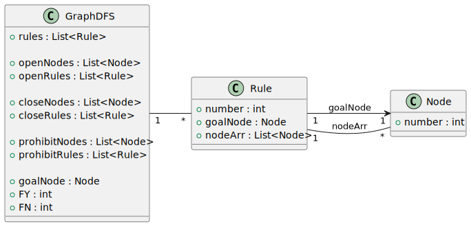

# Основная часть

## Описание метода

Обратный поиск в глубину — это метод, который используется для нахождения пути от заданной цели к начальным вершинам в графе И/ИЛИ. В процессе работы используются следующие списки: 

- стек открытых вершин,
- множество закрытых вершин,
- стек открытых правил,
- множество закрытых правил,
- множество запрещённых вершин,
- множество всех правил (база правил).

## Постановка задачи

Необходимо разработать класс метода поиска в глубину, полями которого являются указанные списки, а также два флага: $FY$ -- есть решение и $FN$ -- нет решения. В конструктор класса передаются список базы правил, целевая вершина и массив заданных входных вершин.

В конструкторе входные вершины записываются в закрытые вершины, целевая вершина помещается в голову стека (список открытых вершин), флаги решения устанавливаются в единицу. Все вершины помечаются флагами, равными нулю.

Разрабатываются четыре метода:

1. **«Потомки»** — определяет первое правило, которое раскрывает текущую подцель, и возвращает, было ли найдено правило.
2. **«Поиск» (основной метод)** — вызывает все методы алгоритма. Работает в цикле while, пока флаги равны единице.
3. **«Возврат» (back tracking)** — отсекает запрещённые вершины и правила.
4. **«Разметка»** — формирует список закрытых правил, составляющих дерево решения, и список закрытых (доказанных) вершин.

## Алгоритм метода «Потомки»

Текущая подцель выбирается из головы стека открытых вершин. В цикле по базе правил определяется первое правило, выходная вершина которого совпадает с подцелью (раскрывает эту вершину). Номер правила записывается в голову стека открытых правил. Затем определяются новые подцели и записываются в стек открытых вершин. Для этого необходимо определить, какие вершины выбранного правила из входных не входят в закрытые. Сначала это заданные входные вершины. Эти вершины добавляются в голову стека открытых вершин.

Если входные вершины правила попали в закрытые, то новых подцелей нет. Если выходная вершина является целевой, то флаг решения устанавливается в ноль ($FY$ = 0). Если выходная вершина не является целевой, вызывается процедура разметки.

Доказанное правило и его выходную вершину необходимо перезаписать в закрытые и удалить из закрытых.

## Алгоритм возврата

Если потомков не найдено, функция возвращает ноль. Это означает, что текущая подцель должна быть объявлена как запрещённая вершина, а само правило — как запрещённое. Необходимо удалить текущую подцель из стека открытых правил (из головы), объявить правило из головы стека запрещённым, удалить его и перенести в запрещённые. Также необходимо удалить из стека все вершины, которые являлись входными вершинами найденного запрещённого правила. После этого снова вызывается поиск потомков для поиска альтернативного пути. Если альтернативы нет, то снова происходит возврат.

Если в стеке открытых вершин осталась только целевая, а поисков нет, то нет решения (флаг FN = 0).

## Алгоритм разметки 


Этот алгоритм используется для построения дерева решения и закрытия вершин и правил. Он работает путём последовательного подъема снизу-вверх по дереву. 

Основные шаги алгоритма:

- Извлечение правила из списка открытых правил и добавление его в список закрытых правил.
- Извлечение узла из списка открытых узлов и добавление его в список закрытых узлов.
- Проверка, является ли текущий узел целевым узлом. Если да, то найдено решение.
- Если текущий узел не является целевым, то необходимо вернуться к последнему открытому узлу и последнему открытому правилу и проверить соответствует ли текущее правило текущему узлу. Если нет, то алгоритм завершается.


## Структура классов

На рисунке 1 представлена структура классов разрабатываемой программы.




## Инструменты разработки

Для разработки использовались ЯП Python 3 и система интерактивных вычислений Jupyter Notebook.  Листинг интерактивного блокнота представлен в приложении 1.

## Тестирование

Проверка работоспособности программы была выполнена на графе представленном на рисунке 2.


Для целевой вершины $14$ и закрытых вершин $8$, $31$, $2$, $5$, $6$, $18$, $12$, $13$ было **получено дерево решения** состояшее из узлов $8$, $31$, $2$, $5$, $6$, $18$, $12$, $13$, $3$, $4$, $7$, $11$, $9$, $14$ и правил $104$, $103$, $102$, $107$, $106$, $105$.

Для целевой вершины $14$ и закрытых вершин $1$, $2$, $5$, $6$, $18$, $12$ **решение не найдено**.


# Приложение 1. Листинг блокнота


```py

class Node:
    def __init__(self, number):
        self.number = number

class Rule:
    def __init__(self, number, goalNode, nodeArr):
        self.number = number
        self.goalNode = goalNode
        self.nodeArr = nodeArr


def generateRules(rules):
        nodesHash = {}
        
        for rule in rules:
            nodes = [rule[0]] + rule[1]
            for node in nodes:
                if node not in nodesHash:
                    nodesHash[node] = Node(node)
        return [
             Rule(z, nodesHash[x], [nodesHash[i] for i in y]) for x,y,z in rules
        ], nodesHash

def get_rules():
    return generateRules([ 
            (3,[1,2],101),
            (7,[2,3,4],102),
            (4,[5,6],103),
            (3,[8,31],104),
            (14,[7,9],105),
            (9,[4,18,11],106),
            (11,[12,13],107),
            (33,[21,15],108),
            (19,[13,20,27],109),
            (14,[9,21],110),
            (9,[11,8],111),
            (21,[8,19],112),
            (8,[12,20],113),
            (12,[22,23],114),
            (21,[19,27],115),
        ])


class GraphDFS:
    def __init__(self, rules):
        self.rules = rules

        self.openNodes = []
        self.openRules = []
        
        self.closeNodes = []
        self.closeRules = []
        
        self.prohibitNodes = []
        self.prohibitRules = []


      
        self.goalNode = None
        self.FY = 1
        self.FN = 1

    def print_debug(self, *args):
        # return
        def fp(arr):
            return [x.number for x in arr]

        print(*args)
        print("OPEN:   ", fp(self.openRules), fp(self.openNodes))
        print("Close:  ", fp(self.closeRules), fp(self.closeNodes))
        print("Prohib: ", fp(self.prohibitRules), fp(self.prohibitNodes))
        print("")

    def search(self, goalNode, startNodes):
        self.goalNode = goalNode
        self.openNodes.append(goalNode)

        self.closeNodes = startNodes

        while self.FY and self.FN:
            rulesCount = self.children()

            if self.FY == 0:
                break
            
            if rulesCount == 0 and len(self.openNodes) < 2:
                self.FN = 0
                return

            if rulesCount == 0:
                self.backtracing()

            if self.FY == 0:
                break


        return self.closeRules, self.closeNodes

    # потомки 
    def children(self):
        rulesCount = 0

        for rule in self.rules:
            curNode = self.openNodes[-1]

           
            if rule in self.openRules or rule in self.prohibitRules:
                continue

            if rule.goalNode == curNode:
                self.openRules.append(rule)

                self.print_debug("Children", rule.number)

                openedCount = self.openRuleNodes(rule)

                self.print_debug("openRuleNodes")

                if openedCount == 0:
                    self.markup()
                
                rulesCount += 1
                
                break 
            
            for node in rule.nodeArr:
                if node in self.prohibitNodes:
                    self.prohibitRules.append(rule)
                    self.print_debug("prohib rule", rule.number)
                    continue
            

        return rulesCount
    
    def markup(self):
        while True:
            rule = self.openRules.pop()
            self.closeRules.append(rule)

            node = self.openNodes.pop()
            self.closeNodes.append(node)

            self.print_debug("Markup")

            if node == self.goalNode:
                self.print_debug("Find solution in markup")
                self.FY = 0
                return

            curNode = self.openNodes[-1]
            curRule = self.openRules[-1]
            if curRule.goalNode != curNode:
                return

    def backtracing(self):
        curGoal = self.openNodes.pop()
        self.prohibitNodes.append(curGoal)
        
        rule = self.openRules.pop()
        self.prohibitRules.append(rule)

        for node in rule.nodeArr:
            if node in self.openNodes:
                self.openNodes.remove(node)
        self.print_debug("Backtracing")
        

    def openRuleNodes(self, rule):
        hasNewGoal = False

        for node in rule.nodeArr[::-1]:
            if node in self.closeNodes:
                continue
            self.openNodes.append(node)
            hasNewGoal = True
            
        return hasNewGoal

rules, nodes = get_rules()

def print_res(t):
    if t != None:
        print([x.number for x in t[0]], [x.number for x in t[1]])
    else:
        print("No")


t = GraphDFS(rules).search(nodes[14], [
    nodes[8], nodes[31], nodes[2], nodes[5],
    nodes[6], nodes[18], nodes[12],
    nodes[13]])
print('='*10)
print_res(t)


```