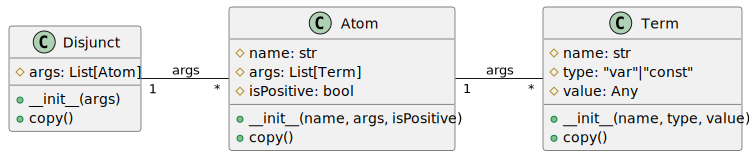

# Основная часть


## Задача логического вывода

Логические системы вывода можно классифицировать на две основные категории:

- Системы опровержения, функционирующие на основе принципа резолюции.
- Системы дедуктивного вывода, которые, в свою очередь, делятся на два подтипа:
   * Прямой вывод.
   * Обратный вывод.

## Унификация

Унификация — это процесс замены предметных переменных аргумента атома другими предметными переменными или константами или функциональными символами.

Подстановка — это последовательность пар или множество вида $\{ t_i / x_i \}$. Подстановка называется унификацией, если атомы совпадают.


Унификация выполняется, если:

- Если термы — константы, то они унифицируем, если совпадают.
- Если в первом атоме терм — переменная, во втором — константа, то они унифицируем, и переменная получает значение константы.
- Если терм в первом атоме — переменная, а во втором — переменная, то они унифицируем, и становятся связанными, можно использовать любое имя.

Унифицируются между собой термы, стоящие на одинаковых местах в контрорных атомах.


## Резолюция

Метод формирования резольвенты заключается в следующем:

- сначала можно для двух атомов сформировать список подстановок с помощью процедуры унификации.
- Следующий шаг — распространение этих значений в атомы первого и второго дизъюнктов, за исключением контрарной пары.

Резольвента — это объединение двух дизъюнктов за исключением контрарной пары. 

Множество подстановок при унификации атомов и дизъюнктов нужно выполнять последовательно, просматривая каждый раз только одну переменную.

## Алгоритм вывода по методу резолюции 

Необходимо создать базу данных, которая будет представлять собой список дизъюнктов. Для каждого дизъюнкта следует определить свои имена переменных, например, $x_1$, $x_2$ и т. д.

Для тех термов, которые имеют значение, необходимо прописать соответствующие константы.


Алгоритм состоит из следующих шагов:

1. Принять отрицание-заключение (того что мы доказываем)
2. Привести все формулы посылок (или аксиом) и отрицание цели к КНФ
3. Получили список дизьюнктов
4. Если существует пара дизьюнктов, содержащие контрарные атомы, то эти дизьюнкты объединяются с удаление контрарной пары
5. Если на каком-то шаге получим два дизьюнкта, одинаковые атомы с разными знаками, то резольвентой будет пустой дизьюнкт или ложь
6. Иначе продолжаем формирование резольвенты (перебор на множестве)


## Структура классов

На рисунке 1 представлена структура классов разрабатываемой программы.



Были разработаны функции:

- Унификации двух атомов
- Резолюции с унификацией двух дизьюнктов
- Логический вывод на основе резолюции


## Инструменты разработки

Для разработки использовались ЯП Python 3 и система интерактивных вычислений Jupyter Notebook.  Листинг интерактивного блокнота представлен в приложении 1.

## Тестирование

Проверка работоспособности программы была выполнена на следующей базе знаний.

- `L(Петя:const, Снег:const)`,
- `L(Петя:const, Дождь:const)`,
- `S(x1:var) | ~M(x1:var)`,
- `S(x2:var) | M(x2:var)`,
- `~M(x3:var) | ~L(x3:var, Дождь:const)`,
- `~S(x4:var) | L(x4:var, Снег:const)`,
- `~L(Лена:const, y1:var) | ~L(Петя:const, y1:var)`,
- `~L(Лена:const, y2:var) | L(Петя:const, y2:var)`.


Результат вывода для цели 

- `L(Лена:const, Снег:const) & ~L(Лена:const, Дождь:const)`.

```
1. ~L(Лена:const, Снег:const) | L(Лена:const, Дождь:const)
2. ~M(x3:var) | ~L(x3:var, Дождь:const)  
Подстановка:  {x3: Лена:const}
==>  ~L(Лена:const, Снег:const) | ~M(Лена:const) 

1. ~L(Лена:const, Снег:const) | ~M(Лена:const)  
2. S(x2:var) | M(x2:var)  
Подстановка: {x2: Лена:const}
==>  ~L(Лена:const, Снег:const) | S(Лена:const) 

1. ~L(Лена:const, Снег:const) | S(Лена:const)
2. ~S(x4:var) | L(x4:var, Снег:const)  
Подстановка: {x4: Лена:const}
==>  Пусто 
```

Результат вывода для цели

- `~L(z1:var, Дождь:const)`

```  
1. L(z1:var, Дождь:const)  
2. ~M(x3:var) | ~L(x3:var, Дождь:const)  
Подстановка: {z1: x3:var}
==>  ~M(x3:var) 

1. ~M(x3:var)
2. S(x2:var) | M(x2:var)  
Подстановка: {x3: x2:var}
==>  S(x2:var) 

1. S(x2:var)  
2. ~S(x4:var) | L(x4:var, Снег:const)  
Подстановка: {x2: x4:var}
==>  L(x4:var, Снег:const) 

1. L(x4:var, Снег:const)  
2. ~L(Лена:const, y1:var) | ~L(Петя:const, y1:var)  
Подстановка: {x4: Лена:const, y1: Снег:const}
==>  ~L(Петя:const, Снег:const) 

1. ~L(Петя:const, Снег:const)  
2. L(Петя:const, Снег:const)
Подстановка: {}
==>  Пусто 
```


# Приложение 1. Листинг кода программы


```py
class Term:
    def __init__(self, name:str, type:str, value=None):
        self.name = name
        self.type = type
        self.value = None
        
        if type == "const":
            if value:   
                self.value = value
            else:
                self.value = name
    
    def __repr__(self):
        return "{:}:{:}".format(self.name, self.type)
    
    def copy(self):
        return Term(self.name, self.type, self.value)


class Atom:
    def __init__(self, name: str, args: list[Term], isPositive = True ):
        self.name = name
        self.args = args
        self.isPositive = isPositive

    def __repr__(self):
        return "{:}{:}({:})".format(
            '~' if not self.isPositive else '', self.name, ", ".join(
            [
                "{:}".format(term) for term in self.args
            ]))

    def copy(self):
        return Atom(self.name, [arg.copy() for arg in self.args], self.isPositive)

class Disjunct:
    def __init__(self, args: list[Atom]):
        self.args = args

    def __repr__(self):
        if len(self.args) == 0:
            return "Пусто"

        return " | ".join(
            [
                "{:}".format(atom) for atom in self.args
            ]
        )

    def copy(self):
        return Disjunct([arg.copy() for arg in self.args])

def parse_disjunct(exp:str):
    atoms = [atom.strip() for atom in exp.split("|")]

    atom_list = []
    
    for atom in atoms:

        isPositive = atom[0] != '~'
        
        if not isPositive:
            atom = atom[1:].strip()

        
        atom_name, atom_args = atom.split('(')

        atom_name = atom_name.strip()
        atom_args = atom_args.split(')')[0].strip()

        atom_terms = [term.strip() for term in atom_args.split(',')]

        terms = [
            Term(
                term, 
                "const" if term[0].capitalize() == term[0] else "var"
            ) for term in atom_terms]
        
        atom_list.append(Atom(atom_name, terms, isPositive))
    
    return Disjunct(atom_list)


print(parse_disjunct('S(x4) | ~M(K)'))

class Unification:
    def UnificateAtoms(self, left:Atom, right:Atom):
        if left.name != right.name:
            return
        if len(left.args) != len(right.args):
            return
        
        substitions = {}

        for i in range(len(left.args)):
            leftTerm = left.args[i]
            rightTerm = right.args[i]

            if leftTerm.type == "const" and rightTerm.type == "const":
                if leftTerm.value != rightTerm.value:
                    return
            elif leftTerm.type == "var" and rightTerm.type == "const":
                substitions[leftTerm.name] = rightTerm

            elif leftTerm.type == "const" and rightTerm.type == "var":
                substitions[rightTerm.name] = leftTerm
            elif leftTerm.type == "var" and rightTerm.type == "var":
                if leftTerm.name != rightTerm.name:
                    substitions[leftTerm.name] = rightTerm
            else:
                print("errr")
        return substitions
                
    def unificateDisjunct(self, left: Disjunct, right: Disjunct):
        unificationCount = 0

        result = left.copy().args + right.copy().args
        
        globalSubstitutions = {}

        localUnificationCount = 1
        while localUnificationCount:
            localUnificationCount = 0
            
            for i, leftAtom in enumerate(result):
                for rightAtom in result[i + 1:]:
                    # print(leftAtom, rightAtom)
                    if leftAtom.name == rightAtom.name:
                        if leftAtom.isPositive == rightAtom.isPositive:
                            substitutions = self.UnificateAtoms(
                                leftAtom.copy(), rightAtom.copy())

                            # print(leftAtom, rightAtom, substitutions)
                            if substitutions != None and len(substitutions) == 0:
                                result.remove(rightAtom)
                                # localUnificationCount += 1
                            continue
                                
                        substitutions = self.UnificateAtoms(
                            leftAtom.copy(), rightAtom.copy())
                        if substitutions == None:
                            continue
                        
                        result.remove(leftAtom)
                        result.remove(rightAtom)
                        
                        
                        for sub in substitutions:
                            globalSubstitutions[sub] = substitutions[sub]

                        # share
                        for atom in result:
                            for term in atom.args:
                                for sub in substitutions:
                                    if sub == term.name:
                                        term.name = substitutions[sub].name
                                        term.type = substitutions[sub].type
                                        if substitutions[sub].type == "const":
                                            term.value = substitutions[sub].value

                        localUnificationCount += 1
                        break
            unificationCount += localUnificationCount

        if not unificationCount:
            return None

        return Disjunct(result), globalSubstitutions

                   


leftDisjunct = parse_disjunct("S(x1) | ~M(x1)")
rightDisjunct = parse_disjunct("S(x2) | M(x2)")

d1 =  Unification().unificateDisjunct(leftDisjunct, rightDisjunct)

print(d1)
                
def get_knowleadge(): 
    return [
        parse_disjunct("L(Петя, Снег)"),
        parse_disjunct("L(Петя, Дождь)"),
        
        parse_disjunct("S(x1) | ~M(x1)"),
        parse_disjunct("S(x2) | M(x2)"),
        parse_disjunct("~M(x3) | ~L(x3, Дождь)"),
        parse_disjunct("~S(x4) | L(x4, Снег)"),
        parse_disjunct("~L(Лена, y1) | ~L(Петя, y1)"),
        parse_disjunct("~L(Лена, y2) | L(Петя, y2)"),
        
    ]

get_knowleadge()      

def resolve(resolving:Disjunct, knowleadge: list[Disjunct], max_counter = 1000):
    resolvingCount = 1
    while resolvingCount > 0 and max_counter > 0:
        resolvingCount = 0

        for rule in knowleadge:
            result = Unification().unificateDisjunct(resolving.copy(), rule.copy())
            if result == None:
                continue

            print(resolving,
             " ~~~ ", rule , " ==== (",result[1],")\n ==> ", result[0], "\n")

            resolving = result[0]
            

            resolvingCount += 1
            max_counter -= 1
            break
        
    if resolvingCount > 0:
        print("Tries out")

    return resolving


print(*get_knowleadge(), sep="\n")
print()
print(resolve(parse_disjunct("~L(Лена, Снег) | L(Лена, Дождь)"), get_knowleadge()))

```