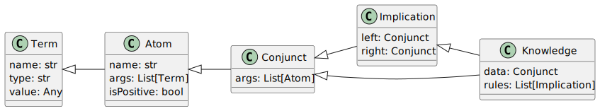

# Основная часть


## Задача логического вывода

Логические системы вывода можно классифицировать на две основные категории:

- Системы опровержения, функционирующие на основе принципа резолюции.
- Системы дедуктивного вывода, которые, в свою очередь, делятся на два подтипа:
   * Прямой вывод.
   * Обратный вывод.

## Унификация

Унификация — это процесс замены предметных переменных аргумента атома другими предметными переменными или константами или функциональными символами.

Подстановка — это последовательность пар или множество вида $\{ t_i / x_i \}$. Подстановка называется унификацией, если атомы совпадают.


Унификация выполняется, если:

- Если термы — константы, то они унифицируем, если совпадают.
- Если в первом атоме терм — переменная, во втором — константа, то они унифицируем, и переменная получает значение константы.
- Если терм в первом атоме — переменная, а во втором — переменная, то они унифицируем, и становятся связанными, можно использовать любое имя.

Унифицируются между собой термы, стоящие на одинаковых местах в контрорных атомах.


## Доказательство правила

В рамках процесса доказательства последовательно рассматриваются входные атомы или вершины текущего правила. 
Доказать атом — значит найти в базе фактов такой атом, в котором совпадают имена предикатов и число аргументов. 
Далее следует унификация переменных: если такой факт найден, то переменная этого атома получает своё значение.
Значение этой переменной затем распространяется на остальные атомы этого правила, в которые она входит (проверяется по имени).
После этого переходим к доказательству следующего атома.

Возможны два варианта: факт в базе отсутствует или присутствует. 
Если факта нет, то правило не доказано.
Если факт доказан, то получаем значения других переменных и распространяем их.
Если входные атомы доказаны, то доказан и выходной атом. 
Выходной атом записывается в базу фактов или заговенье вершины. 
Правило считается доказанным и больше не рассматривается.


## Алгоритм прямого вывода

Система дедукции на основе обобщённых правил продукции представляет собой алгоритм, который позволяет делать логические выводы на основе определённых выражений.
В основе системы лежит метод резолюции, который позволяет обрабатывать более сложные представления знаний.

Алгоритм можно описать следующим образом:

1. В рабочую память или список закрытых вершин посещаем атомы, которые являются фактами
2. Передаём целевой атом (возможно, с переменной, возможно, с константой), вводим два флага FY, FN.
3. Пока оба флага равны единице, выполнить:
   1. Запускаем цикл по открытым правилам:
      1. Проверить доказывается ли правило.
      2. Если доказано, что входные атомы входят в множество фактов, то 
         1. выходной атом правила, в котором уже переменные получили значения, добавляем к фактам или закрытым вершинам.
         2. Доказанное правило делаем закрытым.


## Структура классов

На рисунке 1 представлена структура классов разрабатываемой программы.




Были разработаны функции:

- Унификации двух атомов
- Резолюции с унификацией базы фактов и импликации
- Прямой логический вывод


## Инструменты разработки

Для разработки использовались ЯП Python 3 и система интерактивных вычислений Jupyter Notebook.  Листинг интерактивного блокнота представлен в приложении 1.

## Тестирование

Проверка работоспособности программы была выполнена на следующей базе знаний. Примечение -- c заглавной буквы указаны константы.


$O({N}, {M})$

$M({M})$

$A({W})$

$E({N}, {A})$

$W({y}) \wedge A({x}) \wedge S({x}, {y}, {z}) \wedge H({z}) \rightarrow C({x})$

$M({x_1}) \wedge O({N}, {x_1}) \rightarrow S({W}, {x_1}, {N})$

$M({x_2}) \rightarrow W({x_2})$

$E({x_3}, {A}) \rightarrow H({x_3})$

- 1 шаг 
  - База фактов: $O({N}, {M}) \wedge M({M}) \wedge A({W}) \wedge E({N}, {A})$
  - Правило: $M({x_1}) \wedge O({N}, {x_1}) \rightarrow S({W}, {x_1}, {N})$
  - $\Rightarrow$ $S({W}, {M}, {N})$ с подстановкой $\{x_1 / {M}\}$
- 2 шаг
  - База фактов: $O({N}, {M}) \wedge M({M}) \wedge A({W}) \wedge E({N}, {A}) \wedge S({W}, {M}, {N})$
  - Правило: $E({x_3}, {A}) \rightarrow H({x_3})$
  - $\Rightarrow$ $H({N})$ с подстановкой $\{x_3 / {N}\}$
- 3 шаг
  - База фактов: $O({N}, {M}) \wedge M({M}) \wedge A({W}) \wedge E({N}, {A}) \wedge S({W}, {M}, {N}) \wedge H({N})$
  - Правило: $M({x_2}) \rightarrow W({x_2})$
  - $\Rightarrow$ $W({M})$ с подстановкой $\{x_2 / {M}\}$
- 4 шаг
  - База фактов: $O({N}, {M}) \wedge M({M}) \wedge A({W}) \wedge E({N}, {A}) \wedge S({W}, {M}, {N}) \wedge H({N}) \wedge W({M})$
  - Правило: $W({y}) \wedge A({x}) \wedge S({x}, {y}, {z}) \wedge H({z}) \rightarrow C({x})$
  - $\Rightarrow$ $C({W})$ с подстановкой $\{y / {M},x / {W},z / {N}\}$


# Приложение 1. Листинг кода программы


```py
class Term:
    def __init__(self, name:str, type:str, value=None):
        self.name = name
        self.type = type
        self.value = None
        
        if type == "const":
            if value:   
                self.value = value
            else:
                self.value = name    
  
    def copy(self):
        return Term(self.name, self.type, self.value)


class Atom:
    def __init__(self, name: str, args: list[Term], isPositive = True ):
        self.name = name
        self.args = args
        self.isPositive = isPositive

   def copy(self):
        return Atom(self.name, [arg.copy() for arg in self.args], self.isPositive)


class Conjunct:
    def __init__(self, args: list[Atom]):
        self.args = args

    def copy(self):
        return Conjunct([arg.copy() for arg in self.args])

class Implication:
    def __init__(self, left: Conjunct, right : Conjunct):
        self.left = left
        self.right = right

    def copy(self):
        return Implication(self.left.copy(), self.right.copy())

class Knowleadge:
    def __init__(self, data: Conjunct, rules: list[Implication]):
        self.data = data
        self.rules = rules

    def copy(self):
        return Knowleadge(
            self.data.copy(),
              [rule.copy() for rule in self.rules]
        )

def parse_term(exp:str):
    exp = exp.strip()

    if ':' in exp:
        name, t = [e.strip() for e in exp.split(':')]
        return Term(name, t)
    

    return Term(exp, "const" if exp[0].capitalize() == exp[0] else "var")


def parse_atom(exp:str):
    exp = exp.strip()

    isPositive = exp[0] != '~'
        
    if not isPositive:
        exp = exp[1:].strip()

    
    atom_name, atom_args = exp.split('(')

    atom_name = atom_name.strip()
    atom_args = atom_args.split(')')[0].strip()

    atom_terms = [parse_term(term) for term in atom_args.split(',')]
    
    return Atom(atom_name, atom_terms, isPositive)

def parse_conjunct(exp:str):
    exp = exp.strip()
    atoms = [parse_atom(atom) for atom in exp.split("&")]
    
    return Conjunct(atoms)

def parse_implication(exp:str): 
    exp = exp.strip()
    left, right = exp.split("->")
    return Implication(parse_conjunct(left), parse_conjunct(right))

print(parse_implication('S(x4) & ~M(Kola) -> R(x4)'))

def add_substitution(substitions: map, sub:str, term: Term):
    for s in substitions:
        if substitions[s].name == sub:
            substitions[s] = term
    substitions[sub] = term

def UnificateAtoms(left:Atom, right:Atom):
    if left.name != right.name:
        return
    if len(left.args) != len(right.args):
        return
    
    substitions = {}

    for i in range(len(left.args)):
        leftTerm = left.args[i]
        rightTerm = right.args[i]

        if leftTerm.name == rightTerm.name:
            continue

        if leftTerm.type == "const" and rightTerm.type == "const":
            if leftTerm.value != rightTerm.value:
                return
        elif leftTerm.type == "var" and rightTerm.type == "const":
            add_substitution(substitions, leftTerm.name, rightTerm)
        elif leftTerm.type == "const" and rightTerm.type == "var":
            add_substitution(substitions, rightTerm.name, leftTerm)
        elif leftTerm.type == "var" and rightTerm.type == "var":
            if leftTerm.name != rightTerm.name:
                add_substitution(substitions, leftTerm.name, rightTerm)
        else:
            print("errr")
    return substitions   
                

def ShareSubstitutions(substitutions, atoms: list[Atom]):
    for atom in atoms:
        for term in atom.args:
            for sub in substitutions:
                if sub == term.name:
                    term.name = substitutions[sub].name
                    term.type = substitutions[sub].type
                    if substitutions[sub].type == "const":
                        term.value = substitutions[sub].value
                    else:
                        term.isLinked = True

def Concluse(data: Conjunct, implicat: Implication):
    # print(data.args, implicat)

    result = implicat.right.copy()

    implicatAtoms = implicat.left.copy()
    
    globalSubstitutions = {}
    
    counter = 1
    while counter:
        counter = 0
        for implicatAtom in implicatAtoms.args:
            for dataAtom in data.args:
                if implicatAtom.isPositive != dataAtom.isPositive:
                    continue

                # print("Try", implicatAtom, dataAtom)
                substitutions = UnificateAtoms(implicatAtom, dataAtom)
                if substitutions == None:
                    continue
                # print("Unificated", implicatAtom, dataAtom, "Sub", substitutions)

                for sub in substitutions:
                    add_substitution(globalSubstitutions, sub, substitutions[sub])
                
                implicatAtoms.args.remove(implicatAtom)

                ShareSubstitutions(substitutions, result.args + implicatAtoms.args)
                counter += 1
                break
            
    if len(implicatAtoms.args):
        # print("Not resolved", implicatAtoms.args)
        return None
    return result, globalSubstitutions

def parse_knowleadge(exp: str):
    data = []
    rules = []

    for string in exp.splitlines():
        string = string.strip()

        if not string:
            continue

        try:
            impl = parse_implication(string)
            rules.append(impl)
        except:
            atom = parse_atom(string)
            data.append(atom)
    return Knowleadge(Conjunct(data), rules)
    

def get_knowleadge(): 
    return parse_knowleadge(
"""
O(N, M)
M(M)
A(W)
E(N, A)
                            
W(y) & A(x) & S(x,y,z) & H(z) -> C(x)
M(x_1) & O(N, x_1) -> S(W, x_1, N)
M(x_2) -> W(x_2)
E(x_3,A) -> H(x_3)
""")


def substitution_to_latex(subs):
    return "\\{" + ",".join([
            sub + " / " + subs[sub].to_latex() for sub in subs
        ]
    ) +"\\}"
    
        

def KnowleadgeProve(knowleadge: Knowleadge, goal: Atom):
    goal = goal.copy()
    knowleadge = knowleadge.copy()
    
    openRules = knowleadge.rules
    

    def isApplied(atoms:list[Atom], goal: Atom):
        def equalTypes(left:Atom, right: Atom):
            if left.name != right.name:
                return False
            if len(left.args) != len(right.args):
                return False
            for i in range(len(left.args)):
                if left.args[i].type != right.args[i].type:
                    return False
            return True

        for atom in atoms:
            if atom.isPositive != goal.isPositive or not equalTypes(atom, goal):
                continue
            if UnificateAtoms(atom, goal) != None:
                return True
        return False
    
    if isApplied(knowleadge.data.args, goal):
        return True

    counter = 1
    while counter and openRules:
        counter = 0
        for rule in openRules:
            res = Concluse(knowleadge.data, rule)
            if res: 
                knowleadge.data.args += res[0].args
                if isApplied(res[0].args, goal):
                    return True
                
                openRules.remove(rule)
                counter += 1

    print(knowleadge)
    return False


print((get_knowleadge().to_latex()))
print()
KnowleadgeProve(get_knowleadge(), parse_atom("C(W)"))


```