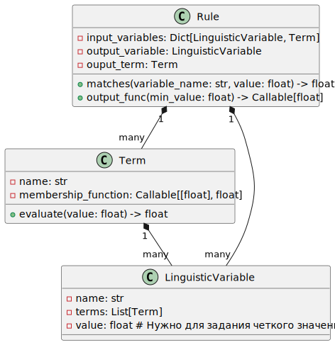
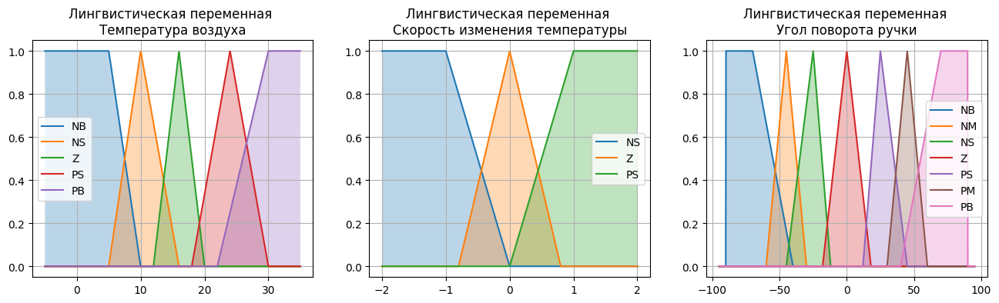
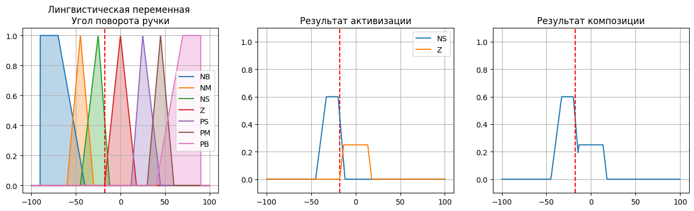
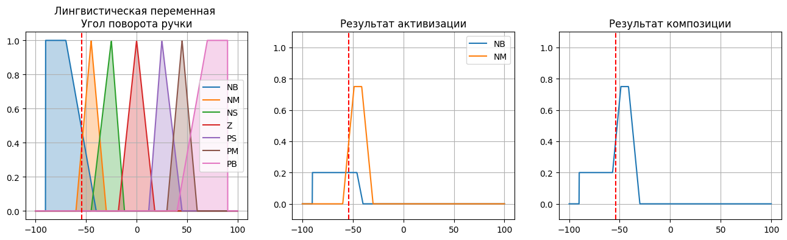

# Основная часть

## Задаче нечеткого логического вывода

В нечетких множествах принадлежность элемента определяется функцией принадлежности, принимающей значения от нуля до единицы, что означает принадлежность с определенной степенью уверенности. Функция принадлежности может быть табличной или непрерывной.

Нечеткую переменную описывают названием, глобальной областью определения и функцией принадлежности.

Нечеткая логика — это математическая формализация нечетких рассуждений, основанная на идее, что элементы множества могут принадлежать ему с различной степенью уверенности.

Для описания понятий в нечеткой логике вводят лингвистическую переменную с термами, заданными функцией принадлежности.

Нечеткие предикаты — это высказывательные функции с аргументами в нечетких переменных, степень истинности которых определяется функцией принадлежности аргумента.

## Этапы вывода

Фазификация — определение термов с отличной от нуля функцией принадлежности по значению входной переменной.

Нечеткий логический вывод включает три этапа:

Агрегирование — определение степени истинности условия.

Активизация — определение функции принадлежности заключения по минимуму условия и консеквента.

Композиция — объединение нечетких множеств для формирования результирующего нечеткого подмножества.

Дефазификация — переход от нечеткого подмножества к четкому значению.

## Алгоритм

Метод:

- вычисляет степень истинности предпоссылки 
- выполняется отсечение функции принадлежности соответствующего терма по критерию минимума предпоссылки и консиквента, т.е. в этом методе создаем функцию принадлежности терма по Мамдани. Причем если предпоссылка имеет нулевую степень истинности, то можно возвращать, что правило не активно.

Метод поиска -- на входе четкое значение входной переменной

1. Вычисляем функцию принадлежности для всех термов
2. Просматриваем базу правил 
   1. Для текущего правила определяем активно оно или нет в соответсвием со значением входного терма
   2. Если правило активно, то 
      1. Модифицируем функцию принадлежности выходного терма (отрезаем)
      2. Активвное можно записать в другой список
   3. За цикл просмотра ропределяются все активные правила и 
   4. Вызвать метод композиции

В метода композиции проходим активные правила и объединяем полученные нечеткие подмножества всех активных правил в одно результирующие нечеткое множество.

## Структура классов

На рисунке 1 представлена структура классов разрабатываемой программы.

## Инструменты разработки и детали реализации

Для разработки использовались ЯП Python 3 и система интерактивных вычислений Jupyter Notebook.  Листинг интерактивного блокнота представлен в приложении 1.

Для задания функций принадлежности использовались следующие вспомогательные функции:

- Функция `PointsLian` принимает набор точек и создаёт линейный интерполятор, который возвращает значение `y` для любого заданного значения `x`. Если `x` выходит за пределы диапазона точек, функция возвращает крайние значения `y`.
- Функция `Trap` использует `PointsLian` для создания трапециевидной функции принадлежности с параметрами `a`, `b`, `c` и `d`.
- Функция `Trian` использует `Trap` для создания треугольной функции принадлежности с параметрами `a`, `b` и `c`.
- Функции `min_func` и `max_func` принимают список функций и возвращают новые функции, которые вычисляют минимальное или максимальное значение соответственно для каждого вызова исходных функций.

Функция `Search` выполняет поиск правил, соответствующих текущим значениям лингвистических переменных, и возвращает результирующую функцию.

1. Параметры:
   - `inputVariables`: Список лингвистических переменных, каждая из которых содержит своё текущее значение.
   - `rules`: Список правил, каждое из которых определяет условия и результат для определённых значений лингвистических переменных.

2. Алгоритм:
   - Создается пустой список `result_funcs` для хранения результатов.
   - Для каждого правила из списка `rules` выполняется проверка соответствия условиям этого правила:
     - Перемножаются степени истинности для каждой лингвистической переменной в правиле (используется функция `min` для нахождения минимальной степени истинности).
     - Если степень истинности больше нуля, то к списку `result_funcs` добавляется функция вывода правила.
   - В зависимости от количества найденных соответствий:
     - Если найдено одно правило, возвращается соответствующая функция вывода.
     - Если не найдено ни одного подходящего правила, возвращается нулевая функция (всегда возвращает 0).
     - Если найдено несколько правил, используется функция `max_func` для объединения их результатов в одну функцию, которая выбирает максимум из всех возможных значений.

Функция `center_of_mass` рассчитывает координату центра масс для непрерывной функции $f(x)$ на интервале $[a, b]$ по формуле:

$$ \text{Центр масс} = \frac{\int_a^b x \cdot f(x) \, dx}{\int_a^b f(x) \, dx} $$

Используется модуль `quad` из библиотеки `scipy.integrate` для численного интегрирования.

## Тестирование

Для проверки работы использовались следующие логические переменные:

- Температура воздуха
- Скорость изменения температуры
- Угол поворота ручки

Значения термов лингвистических переменных показано на рисунке 2.

База правил состоит из следующих:

- `Температура воздуха=PB & Скорость изменения температуры=PS`
    -  `-> Угол поворота ручки=NB`
- `Температура воздуха=PB & Скорость изменения температуры=NS`
    -  `-> Угол поворота ручки=NS`
- `Температура воздуха=PS & Скорость изменения температуры=PS`
    -  `-> Угол поворота ручки=NM`
- `Температура воздуха=PS & Скорость изменения температуры=NS`
    -  `-> Угол поворота ручки=Z`
- `Температура воздуха=NB & Скорость изменения температуры=NS`
    -  `-> Угол поворота ручки=PB`
- `Температура воздуха=NB & Скорость изменения температуры=PS`
    -  `-> Угол поворота ручки=PS`
- `Температура воздуха=NS & Скорость изменения температуры=NS`
    -  `-> Угол поворота ручки=PM`
- `Температура воздуха=NS & Скорость изменения температуры=PS`
    -  `-> Угол поворота ручки=Z`
- `Температура воздуха=PB & Скорость изменения температуры=Z `
    -  `-> Угол поворота ручки=NM`
- `Температура воздуха=PS & Скорость изменения температуры=Z `
    -  `-> Угол поворота ручки=NS`
- `Температура воздуха=NB & Скорость изменения температуры=Z `
    -  `-> Угол поворота ручки=PM`
- `Температура воздуха=NS & Скорость изменения температуры=Z `
    -  `-> Угол поворота ручки=PS`
- `Температура воздуха=Z  & Скорость изменения температуры=PS`
    -  `-> Угол поворота ручки=NS`
- `Температура воздуха=Z  & Скорость изменения температуры=NS`
    -  `-> Угол поворота ручки=PS`
- `Температура воздуха=Z  & Скорость изменения температуры=Z `
    -  `-> Угол поворота ручки=Z`

### Пример 1

Пример работы программы для:

- Температура воздуха (T) = 17
- Скорость изменения температуры (S) = 0.6

Было получено новое значение угла поворота ручки = -17.675

\clearpage

### Пример 2

Пример работы программы для:

- Температура воздуха (T) = 32
- Скорость изменения температуры (S) = 0.2

Было получено новое значение угла поворота ручки = -54.046

# Приложение 1. Листинг интерактивного блокнота

